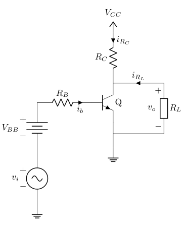
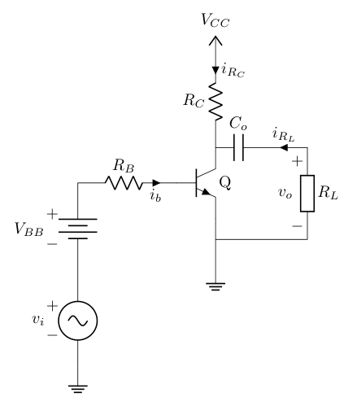
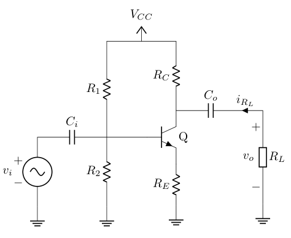

# Common emitter simulations

Just a repo simulating 3 different BJT common emitter amplifier setups.


## Requirements

* ngspice >= 43
* gnuplot >= 6.0

## Usage

Run Ngspice in batch mode for any spice file, it will invoke gnuplot scripts for
you and will generate a png image with the same name in plots folder, for
example the command
```
$ ngspice -b amplifier3.sp
```
will generate `plots/amplifier3.png`

## Circuit Schematics

### Simplest setup: `amplifier1.sp`



### Coupling coupling output Capacitor: `amplifier2.sp`


### Input biasing: `amplifier3.sp`

